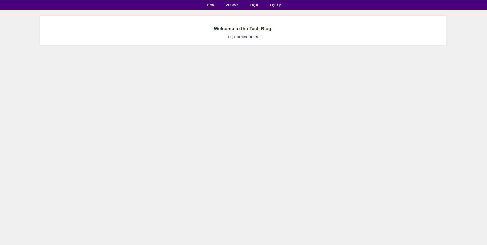
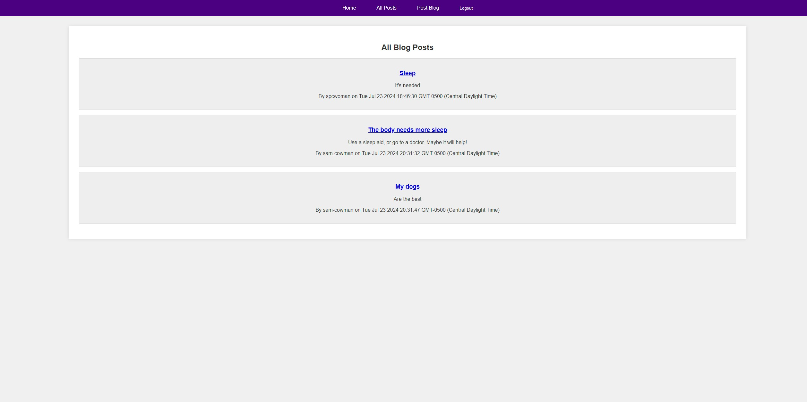

# Tech Blog

## Description

The Tech Blog is a CMS-style blog site designed for developers who write about tech. The platform allows developers to publish articles, blog posts, and share their thoughts and opinions. Users can also comment on other developers' posts, creating an interactive community. The application follows the Model-View-Controller (MVC) paradigm, using Handlebars.js as the templating language, Sequelize as the ORM, and the express-session npm package for authentication.

## Table of Contents

- [Installation](#installation)
- [Usage](#usage)
- [Screenshots](#screenshots)
- [Features](#features)
- [Technologies Used](#technologies-used)
- [Contributing](#contributing)
- [License](#license)
- [Deployed Application](#deployed-application)
- [Questions](#questions)

## Installation

To get a local copy of the project up and running, follow these steps:

1. Clone the repository:
   ```sh
   git clone git@github.com:Sam-Cowman/Tech-Blog-.git
   ```

2. Navigate to the project directory:

    ```sh
    Copy code
    cd tech-blog
    ```

3. Install the necessary dependencies:

    ```sh
    Copy code
    npm install
    ```

4. Set up the PostgreSQL database:

Ensure PostgreSQL is installed and running.
Create a database named blog_db.

5. Create a .env file in the root of the project and add your database credentials:

    ```sh
    DB_NAME='blog_db'
    DB_USER='your_postgres_username'
    DB_PASSWORD='your_postgres_password'
    DB_HOST='localhost'
    DB_PORT=5432
    ```

6. Run the database schema:

    ```sh
    psql -U postgres
    \i db/schema.sql
    \q 
    ```

7. Seed the database with initial data:

    ```sh
    npm run seed
    ```

8. Start the application:

    ```sh
    npm start
    ```

9. Open your browser and navigate to http://localhost:3001.

## Usage
1. Access the Homepage:

* When you first visit the site, you will see the homepage. The homepage includes navigation links for the homepage itself and a dashboard, as well as options to log in or sign up.

2. Sign Up:

* If you don't have an account, click on the sign-up option.
* You will be prompted to create a username, provide your email, and set a password.
* Once you complete the sign-up form and submit it, your account will be created, your credentials will be saved, and you will be logged into the site automatically.

3. Log In:

* If you already have an account, click on the login option.
* Enter your username and password to log in.
* After successfully logging in, you will be redirected to the homepage and you will have access to additional features.

4. Create and Manage Posts:

* Once logged in, you will see a navigation link to the dashboard.
* Click on the dashboard link to access your personal dashboard. Here, you can view all the posts you have created.
* To create a new post, click on the "Create New Post" button. You will be prompted to enter a title and content for your new post.
* After submitting the form, your new post will be saved and displayed on your dashboard.
* You can also edit or delete any of your existing posts from the dashboard.

5. View and Comment on Posts:

* From the homepage, you can click on any post to view its details.
* The post details page will show the post title, content, author's username, and the date it was created.
* Below the post, you can see any comments that have been added.
* If you are logged in, you can add a comment to the post by filling out the comment form and submitting it.

6. Log Out:

* When you are done, you can log out of the site by clicking the logout option in the navigation.
* This will end your session and redirect you to the homepage.

7. Session Timeout:

* If you are idle on the site for an extended period, your session will expire.
* When your session expires, you will still be able to view posts and comments, but you will need to log in again to add, update, or delete posts or comments.

## Screenshots

1. Homepage



2. Sign Up Page


3. Login Page


4. Create Post Page


5. View Post Page



6. Comment on Post


## Features
* User authentication with signup and login functionalities
* Create, read, update, and delete blog posts
* Add comments to blog posts
* User dashboard to manage own posts
* Responsive design

## Technologies Used
* Node.js
* Express.js
* Sequelize (ORM)
* PostgreSQL
* Handlebars.js (templating engine)
* Express-session (for authentication)
* Bcrypt (for password hashing)
* Connect-session-sequelize (to store sessions in the database)

## Contributing

Contributions are welcome! If you have suggestions for improving this project, please fork the repository and create a pull request with your changes.

1. Fork the Project
2. Create your Feature Branch (git checkout -b feature/AmazingFeature)
3. Commit your Changes (git commit -m 'Add some AmazingFeature')
4. Push to the Branch (git push origin feature/AmazingFeature)
5. Open a Pull Request

## License

Distributed under the MIT License. See LICENSE for more information.

## Deployed Application 


## Questions

For any questions or inquiries, please contact me via email at sam.p.cowman@gmail.com.

You can also find more of my work on [GitHub](https://github.com/Sam-Cowman).